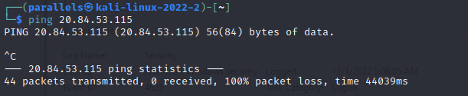
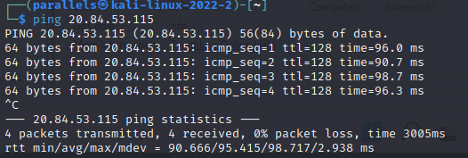
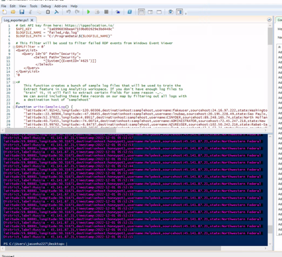
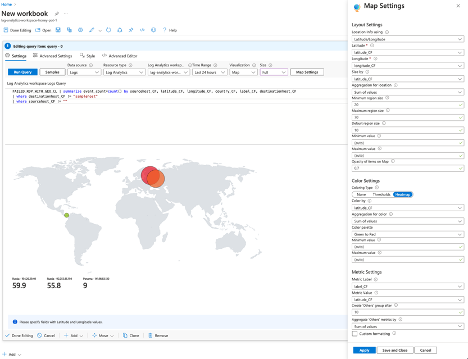
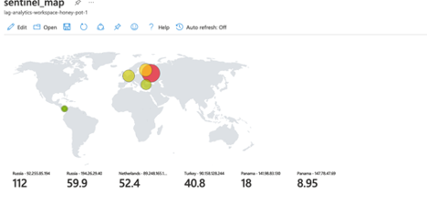
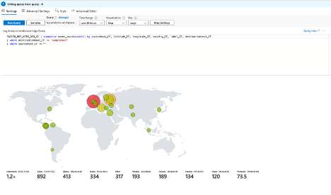

# SIEM_Sentinel

> quick start

#### 1. Create an Azure account and re-definet he firlewall rules in advanced network option. 
> Make sure to open all inbound and outbound ports. 

#### 2. Check if the honeypot machine can be accessed by pinging the address of the VM

> fail ping

 

> successful ping

#### 3. Obtaining a API key from a free IP location API website
> Geolocation API is used here.
<a href="https://ipgeolocation.io/"> https://ipgeolocation.io/</a>

#### 4. Creating exporter log using powershell script
> exporter log can be found at <a href="https://github.com/joshmadakor1/Sentinel-Lab/blob/main/Custom_Security_Log_Exporter.ps1">
joshmadakor1/Sentinel-Lab</a>

#### 5. Run Powershell on vm and create a new workbook on Azure Sentinel to visualize the live attacks.

> 12hr after

> 24hr after

> 48hr after

